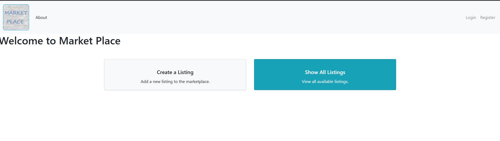

Flask project, a second hand market.

Features:
- register as a user, upload a profile picture
- create listings
- advertise your listing with text and pictures
- look for current listings
- message the user if you want to buy from them
- look at your messages and write back
- edit and delete your listings

Technology:
- Python with Flask framework
- static html with jinja template
- sqlite3 as database with manual queries
- User handling with flask-login
- Password encryption

