Educational project to learn web development in Python Flask. A fully functional second hand market where you can register as a user, post the items you want to sell, look at items of other people and message each others.
I deployed the Application on the provider "digital ocean" once for practice. I used Gunicorn to serve the application on the cloud.

Features:
- register as a user, upload a profile picture
- create listings
- upload pictures of the item
- advertise your listing with text and pictures
- look for current listings
- message the user if you want to buy from them
- look at your messages and write back and forth
- other user gets notified on his landing page with an indicator
- edit and delete your listings

Technologies and their implementation:
- Python Flask is used as a framework, for its ease of use and simple syntax
- Flask-login is used to implement user handling
- password hashing, passwords are stored in the database as a hash
- the secret key for hashing is stored in the environment to protect the key
- pages are generated dynamically, using jinja template
- jinja template allows control structures, this is utilized for html generation (for loop)
- sqlite3 as database with manual queries to practice SQL syntax. With my current knowledge i would transition to using an ORM, SQLAlchemy in the case of flask

Landing page with simple UI, basic CSS

Shows an error, only logged in users can post something
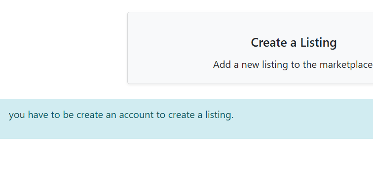

Register page
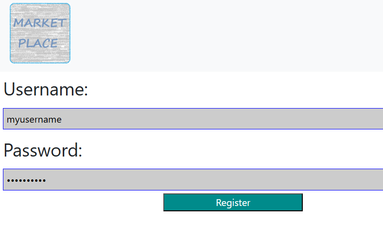

Login page
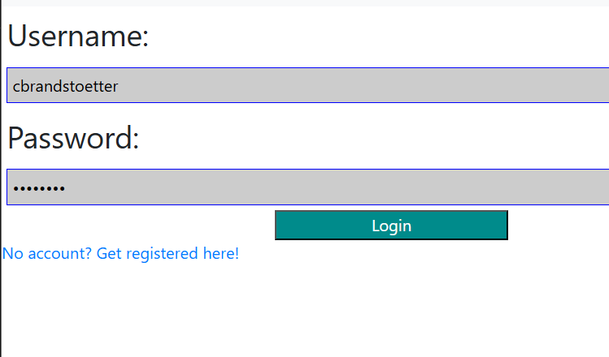

Landing page now shows messages and profile, user can logout
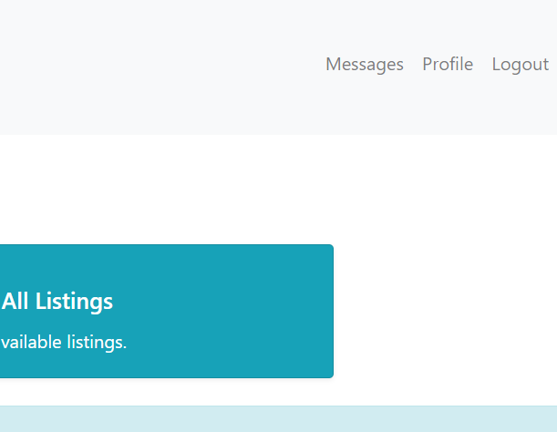

Post an item, providing information. You can upload a picture that gets stored in the database
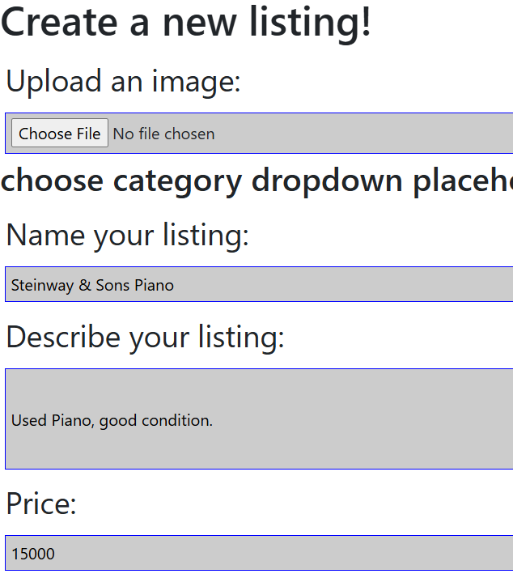

Show all listings that are posted, click on the listings you are interested in
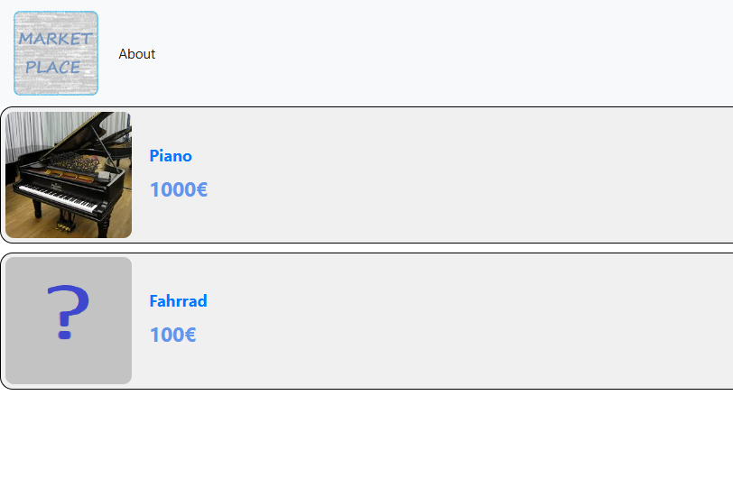

Shows the item in a new page, with all information. Placeholder for categories, work in progress
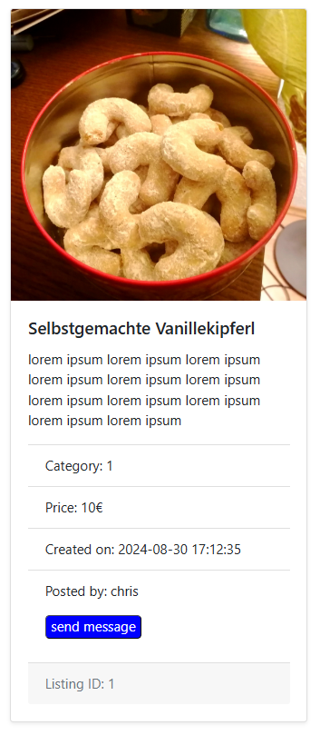

I can send a message to the user that posted the item
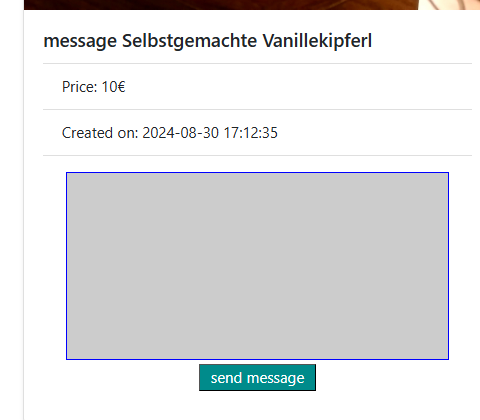

I can see the messages i sent and received
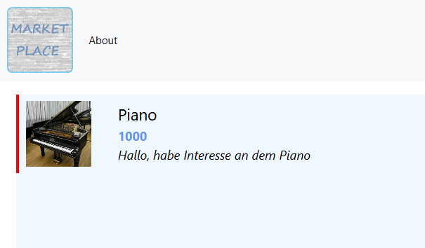

A minimal chat window, has to be reloaded due to server side rendering
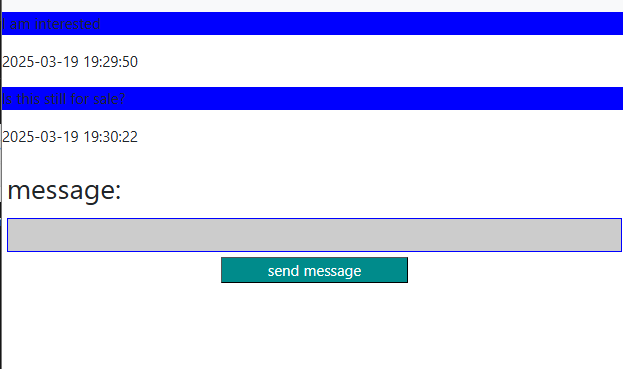

The other user got notified that he has a new message with the red color on messages
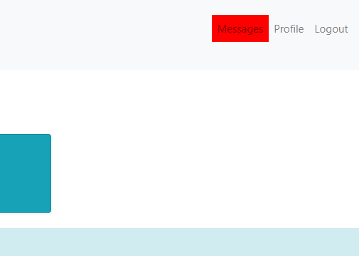

I can see the new message in my messages. Messages i haven't read yet have this red indicator
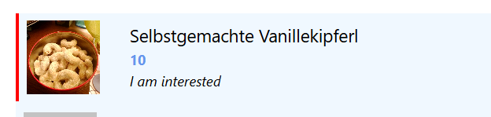

I can look at my profile and show my listings, here I can edit and delete them
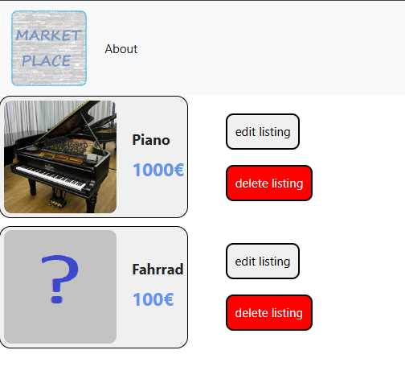

